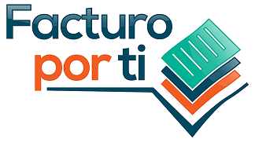
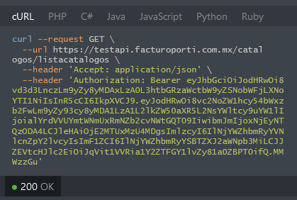
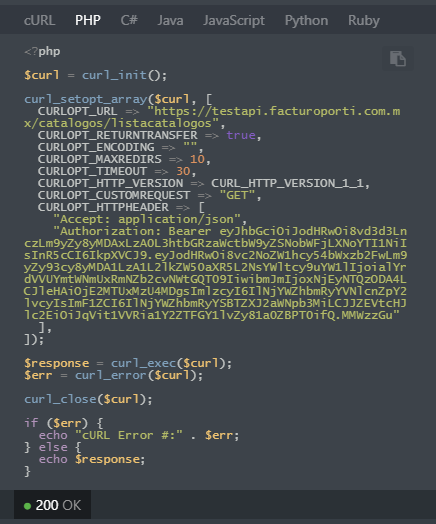
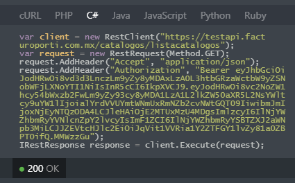
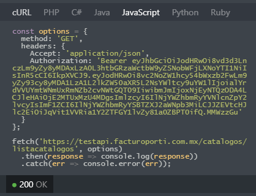
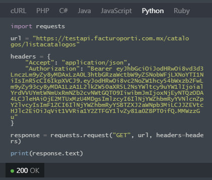
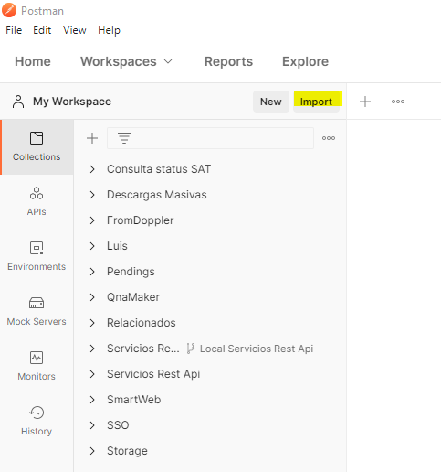
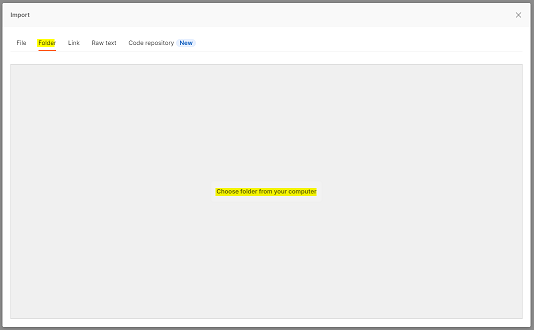
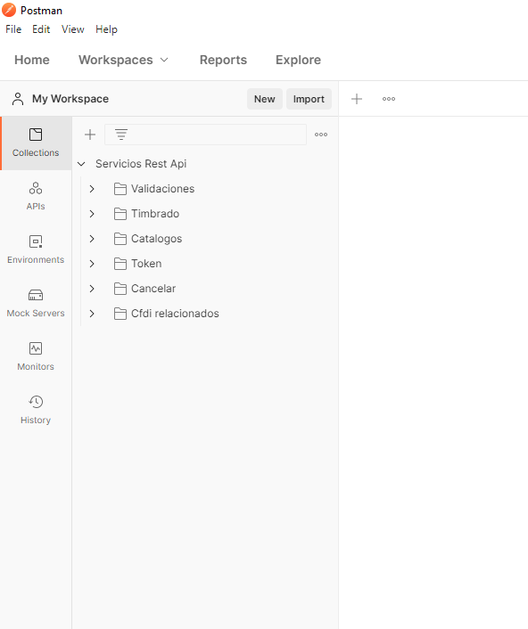

# Código para llamadas a servicios de Rest API

## Actualizacion importante

Nueva versión de Api, la documentación completa contiene herramientas que te facilitarán y ahorran mucho tiempo en validaciones o penalizaciones del sat en auditorías, diríjete a https://developers.facturoporti.com.mx/reference/api-facturacion-electronica como parte de las características podrás:

- Realizar consultas o descargas de los catálogos del sat actualizados.
- Timbra cualquier tipo de cfdi con json o xml
- Genera el PDF con logotipos, direcciones, etc.
- Envía por correo los xml timbrados
- Valida códigos postales y direcciones
- Cancela cfdi
- Consulta cfdi relacionados
- Consulta el estatus del cfdi
- Consulta las solicitudes pendientes de cancelaciones
- Valida exhaustivamente el cfdi (estructura, integridad, vigencia, fecha de emisión del cfdi, fecha de validez del certificado al momento de emisión, sello, matriz de errores del SAT, estatus en el sat, etc).
- Valida las listas negras del sat: efos, edos, no localizados.
- Valida certificados digitales o fiel
- Valida los rfc para verificar si pueden emitir o recibir cfdi
- Recepción de documentos
- Tiene muchas opciones mas y continuamente se integran nuevas funcionalidades.

Este servicios son ideales para usarlo en aplicaciones móviles y/o software que implemente llamadas tipo Rest, el usuario no necesita saber ninguna regla del SAT ni programar la generación del XML de acuerdo al anexo 20, nosotros realizamos todo esto facilitando el proceso de integración de tu sistema y/o aplicación para cumplir con lo que solicita el SAT.

## Generador de código fuente

En cada servicio encontraras una herramienta que generará el código de programación necesario para que lo integres en tu propia aplicación. Tenemos muchos lenguajes soportados como: **cURL, PHP, Java, C#, Javascript, Python, Ruby, etc.** Te dejamos algunos ejemplos de lo que hace nuestro generador de código de programación, para que veas que fácil es usar los servicios. Diríjete a https://developers.facturoporti.com.mx/reference/facturacion-electronica-codigo-fuente 

## Recursos Postman

Postman es una herramienta que tiene muchas opciones para probar servicios rest api es Postman con ella puedes probar o realizar adecuaciones a llamadas Json. Aquí esta el proyecto actualizado de todos los servicios disponibles. Descarga el proyecto que contiene los ejemplos: [https://software.facturoporti.com.mx/TaaS/Json/Api/FacturoPorTi-RestApi.zip](https://software.facturoporti.com.mx/TaaS/Json/Api/FacturoPorTi-RestApi.zip) e instala el programa  [https://www.postman.com/downloads/](https://www.postman.com/downloads/) 

Una vez descargado ambos abre Postman e importar el proyecto

La documentación completa esta en https://developers.facturoporti.com.mx/reference/api-facturacion-electronica

## Ejemplos de cfdi

Como sabemos que hay muchos tipos de documentos que se pueden generar, te dejamos unas guías de llenado de archivos en formato Json  **[descargar ejemplos aquí](https://software.facturoporti.com.mx/TaaS/Json/Api/Ejemplos.zip)** que te asegurarán que puedas timbrar tus documentos sin problemas. Solo necesitas cambiar la **fecha de creación** del cfdi. Estan divididos en:

  * Factura
  * Carta Porte
  * REP
  * Nota de cargo
  * Nota de crédito
  * Recibo de arrendamiento
  * Recibo de donativo
  * Recibo de honorarios
 
Para generar recibos de nomina:

  * Nomina 
  * Aguinaldos
  * Asimilados a salarios
  * Horas extras
  * Incapacidad
  * Jubilación o retiro
  * Separación o indemnización
  * Subsidio al empleo
  * Todas las opciones

## Precios

**¿Necesitas ayuda o requieres contratar los servicios?** Envíanos un email a soporte@facturoporti.com.mx ventas@facturoporti.com.mx, dirígete a la página https://www.facturoporti.com.mx/api-de-facturacion-electronica/ platica con nosotros en línea o llámanos a los teléfonos 555 546 2288 o al 558 421 7675 con mucho gusto podremos darte lo que necesitas. 

## License

Desarrollado en México por [FacturoPorTi](https://www.FacturoPorTi.com.mx). [Licencia de uso](https://github.com/facturoporti/factura-electronica-rest-api-C-Sharp/blob/master/Licencia).
****
